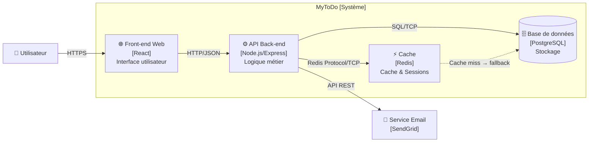
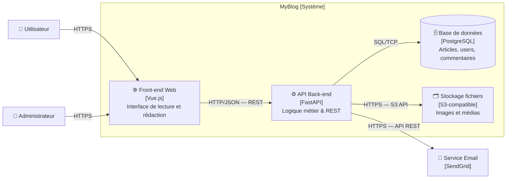
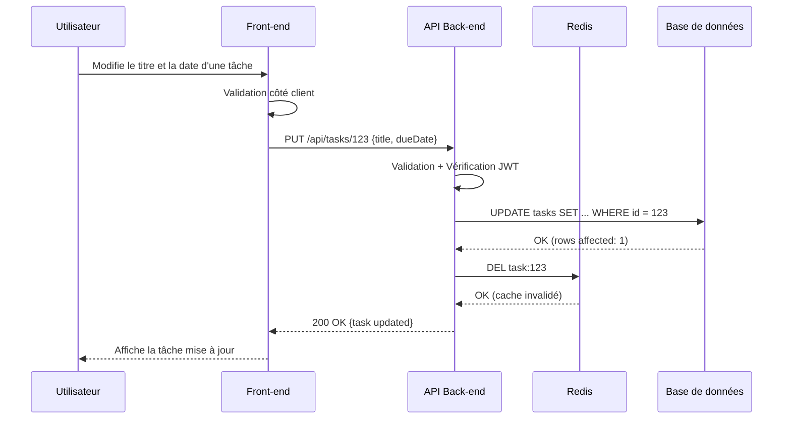
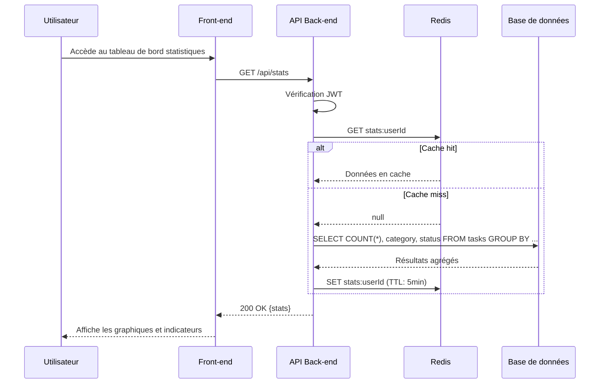
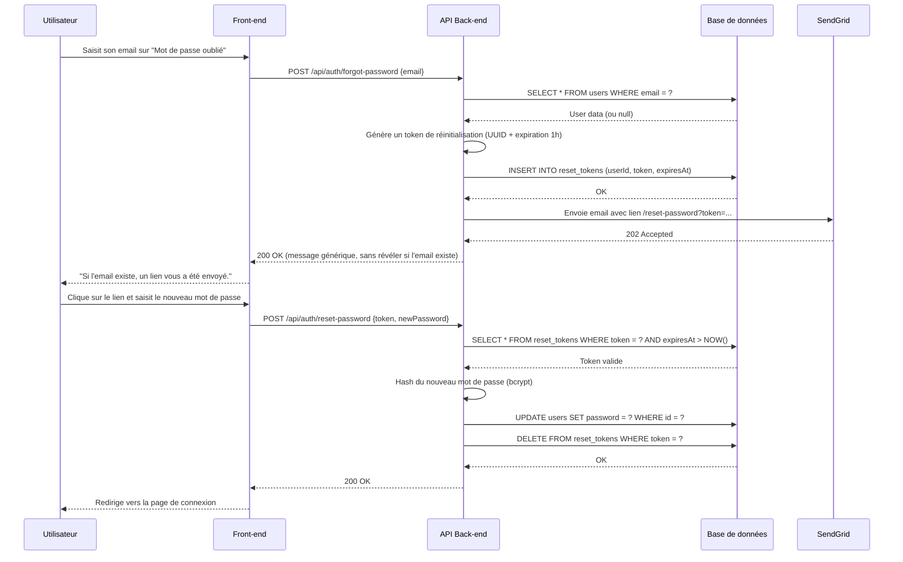

# Exercices pratiques C2 — MyToDo

---

## Exercice 1 — Enrichir l'architecture : ajout de Redis

### Container ajouté : Redis (Service de cache)

**Justification :**
Redis est un store clé-valeur en mémoire utilisé comme couche de cache entre l'API Back-end et la base de données PostgreSQL. Il permet de réduire la charge sur la base de données pour les requêtes fréquentes (ex : liste des tâches d'un utilisateur, données de session) et d'améliorer les temps de réponse de l'application.

**Interactions :**
- L'API Back-end interroge Redis **avant** PostgreSQL. Si la donnée est en cache (cache hit), elle est retournée directement sans requête SQL.
- Si la donnée est absente (cache miss), l'API interroge PostgreSQL, puis stocke le résultat dans Redis pour les prochaines requêtes.
- Lors d'une modification ou suppression de tâche, l'API invalide les entrées Redis correspondantes pour garantir la cohérence des données.

### Diagramme C2 enrichi

---

## Exercice 2 — Diagramme C2 personnalisé (Stack Python)

Application : **MyBlog** — plateforme de publication d'articles avec système de commentaires.

**Annotations des connexions :**

| Connexion | Protocole | Usage |
|---|---|---|
| Utilisateur → Front-end | HTTPS | Navigation, lecture, soumission de formulaires |
| Front-end → API | HTTP/JSON (REST) | Appels CRUD vers les endpoints FastAPI |
| API → PostgreSQL | SQL/TCP | Lecture et écriture des données métier |
| API → Stockage S3 | HTTPS / S3 API | Upload et récupération d'images |
| API → SendGrid | HTTPS / API REST | Envoi d'emails (confirmation, notification) |

---

## Exercice 3 — Diagrammes de séquence

### Scénario A : Modification d'une tâche

---

### Scénario B : Consultation des statistiques

---

### Scénario C : Réinitialisation de mot de passe

---

## Exercice 4 — Tableau des responsabilités (Fait / Ne fait pas)

### Front-end Web [React]

| ✅ Fait | ❌ Ne fait pas |
|---|---|
| Affiche l'interface utilisateur et les vues | Accède directement à la base de données |
| Valide les données côté client (format, champs requis) | Applique les règles métier (ex : droits d'accès) |
| Envoie les requêtes HTTP à l'API Back-end | Stocke des données sensibles (tokens en localStorage non sécurisé) |

---

### API Back-end [Node.js/Express]

| ✅ Fait | ❌ Ne fait pas |
|---|---|
| Applique la logique métier et les règles de gestion | Génère ou affiche du HTML/CSS |
| Authentifie et autorise les requêtes (JWT) | Communique directement avec des services externes sans passer par une couche d'abstraction |
| Orchestre les appels vers la base de données et les services tiers | Stocke des fichiers binaires ou des médias |

---

### Base de données [PostgreSQL]

| ✅ Fait | ❌ Ne fait pas |
|---|---|
| Stocke et persiste les données de manière fiable | Exécute de la logique métier complexe |
| Garantit l'intégrité des données (contraintes, clés étrangères) | Envoie des emails ou des notifications |
| Répond aux requêtes SQL de l'API | Gère l'authentification des utilisateurs |

---

### Cache [Redis]

| ✅ Fait | ❌ Ne fait pas |
|---|---|
| Met en cache les résultats de requêtes fréquentes | Sert de source de vérité (les données ne sont pas persistées de façon fiable) |
| Stocke les sessions utilisateur | Remplace la base de données pour les données critiques |
| Accélère les temps de réponse de l'API | Applique des règles de validation ou de sécurité |
