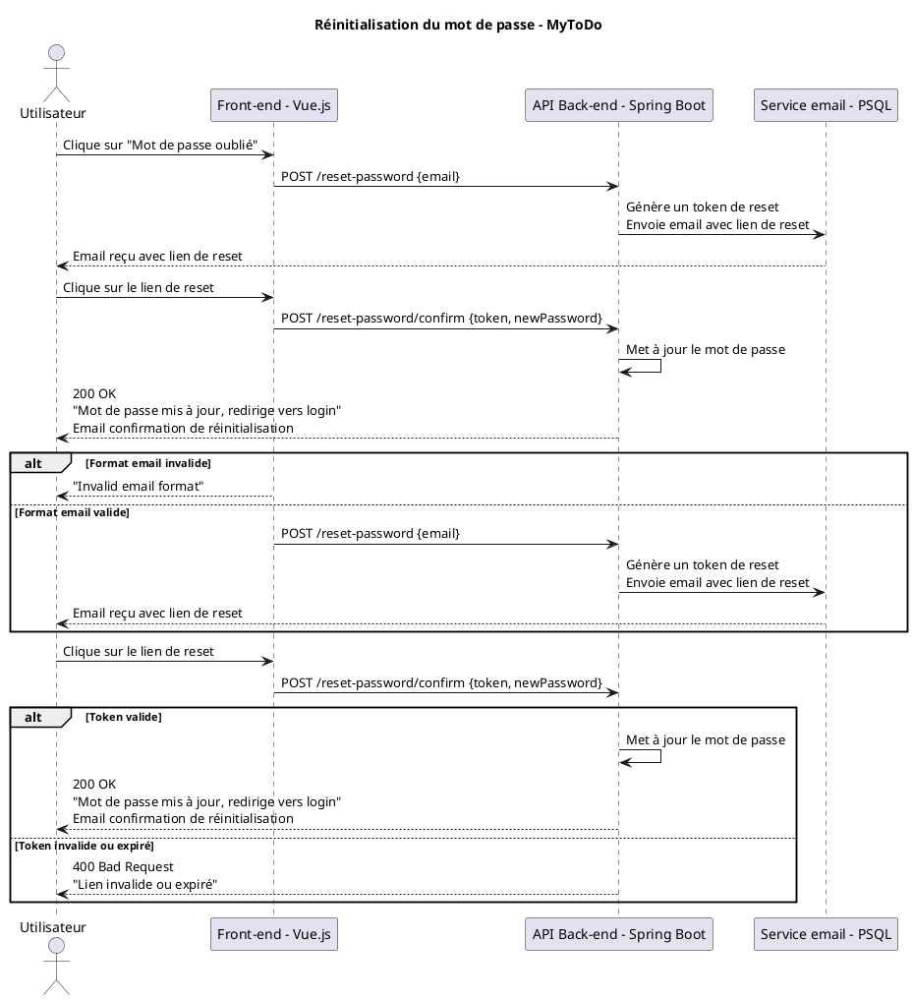
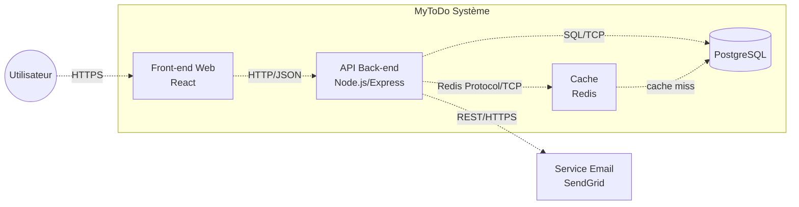

# Glossaire C2 + Exercice 1 MyToDo

## Définition "Container"
**Container (C4 Model)** : Unité d'exécution ou de stockage **séparément déployable** (app web, service API, DB). **Attention** : ≠ Docker.

## Tableau Containers MyToDo (enrichi Redis)
| Container       | Responsabilité                                   | Technologie       | Protocole            |
|-----------------|--------------------------------------------------|-------------------|----------------------|
| Front-end Web  | Interface utilisateur, interactions              | React             | HTTP/JSON            |
| API Back-end   | Logique métier, auth, validation                 | Node.js/Express   | REST API             |
| Base de données| Stockage tâches/users/catégories                 | PostgreSQL        | SQL/TCP              |
| Cache          | Cache req. freq. (dashboards), sessions          | Redis             | Redis Protocol/TCP   |

## Diagramme de séquence personnalisée C2 PlantUML 

## 3 Diagrammes de séquences

# Tableau Responsabilités (Ex4)

| Container | ✅ Doit faire | ❌ Ne doit pas faire |
|-----------|---------------|---------------------|
| Front-end | 1. Affichage UI 2. Validation client 3. Appels API | 1. Logique métier 2. Accès DB direct 3. Stockage persistant |
| API Back-end | 1. Auth Bearer 2. Validation serveur 3. Orchestrer Cache/DB | 1. Générer HTML 2. UI state 3. Cache persistant |
| Base données | 1. Stockage ACID 2. Indexation 3. Backup | 1. Logique métier 2. Cache temp 3. Auth |
| Cache Redis | 1. Cache sessions 2. Listes tâches freq 3. TTL expire | 1. Données critiques 2. Persistance seule 3. Logique métier |
