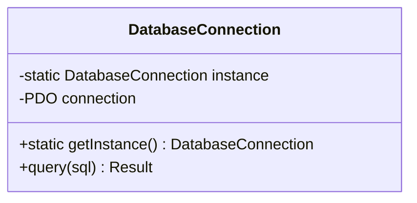
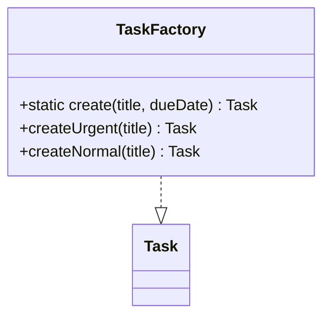
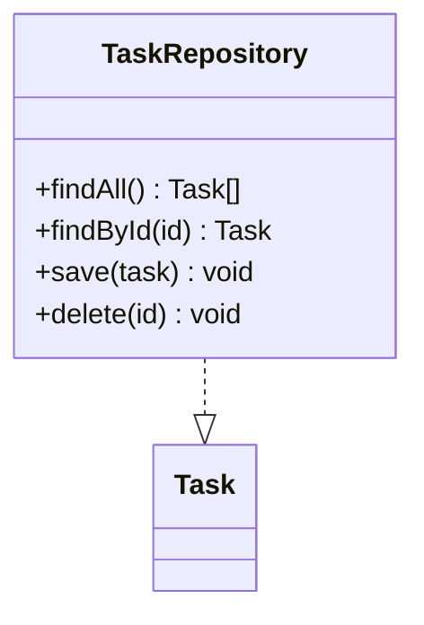
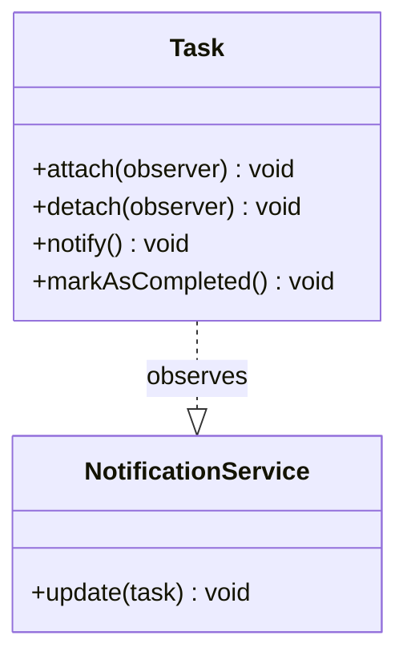

## 1.3 - Design Patterns appliqués à MyToDo

### 1. Singleton - DatabaseConnection
Une seule connexion à la base de données pour toute l'app.

### 2. Factory - TaskFactory  
Fabrique des tâches avec les bonnes priorités.

### 3. Repository - TaskRepository  
Gère tout ce qui touche aux tâches en base.

### 4. Observer - NotificationService  
Préviens quand une tâche change d'état.

| Pattern    | Problème résolu                           | Exemple MyToDo                 |  |
| ---------- | ----------------------------------------- | ------------------------------ | ------- |
| Singleton  | Instance unique pour ressources partagées | DatabaseConnection             |         |
| Factory    | Création flexible d'objets                | TaskFactory                    |         |
| Repository | Abstraction de l'accès aux données        | TaskRepository, UserRepository |         |
| Observer   | Notification automatique des changements  | NotificationService            |         |