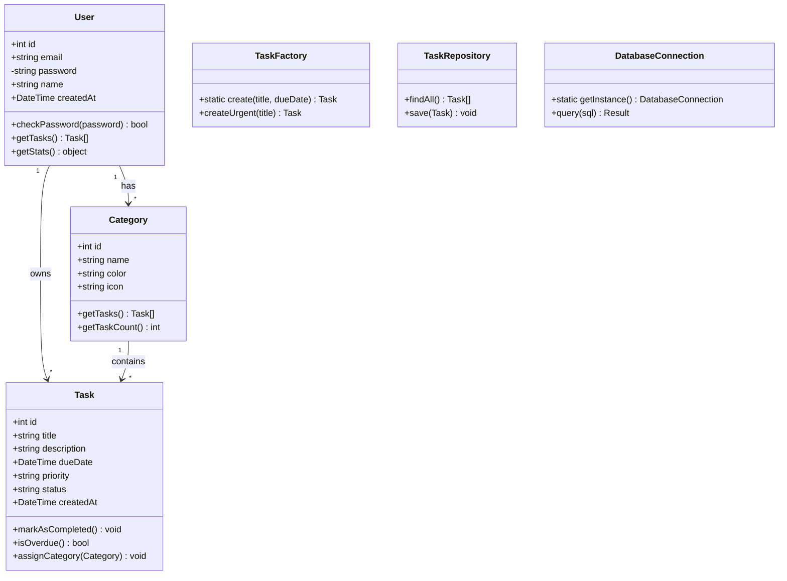
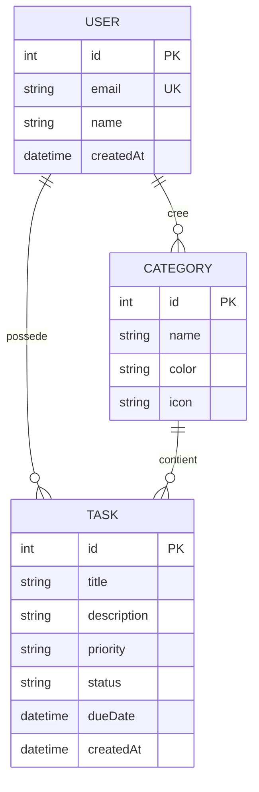
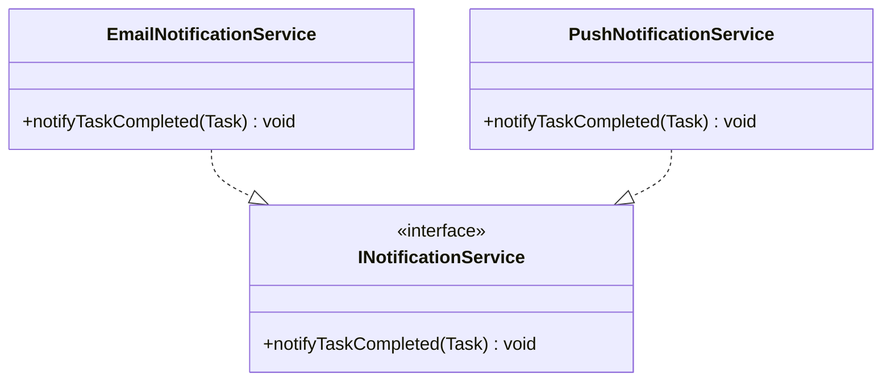

# Diagramme de classe UML

# MCD Complet

# MLD Complet
| Table      | Colonne     | Type                              | Clé | Contraintes                                  |
| ---------- | ----------- | --------------------------------- | --- | -------------------------------------------- |
| users      | id          | SERIAL                            | PK  | NOT NULL                                     |
| users      | email       | VARCHAR(255)                      | UK  | NOT NULL                                     |
| users      | name        | VARCHAR(255)                      |     | NOT NULL                                     |
| users      | created_at  | TIMESTAMP                         |     | DEFAULT NOW()                                |
| categories | id          | SERIAL                            | PK  | NOT NULL                                     |
| categories | name        | VARCHAR(255)                      |     | NOT NULL                                     |
| categories | color       | VARCHAR(7)                        |     | DEFAULT '#000'                               |
| categories | icon        | VARCHAR(50)                       |     | DEFAULT '📁'                                 |
| categories | user_id     | INT                               | FK  | REFERENCES users(id) ON DELETE CASCADE       |
| tasks      | id          | SERIAL                            | PK  | NOT NULL                                     |
| tasks      | title       | VARCHAR(255)                      |     | NOT NULL                                     |
| tasks      | description | TEXT                              |     |                                              |
| tasks      | priority    | ENUM('LOW','MEDIUM','HIGH')       |     | DEFAULT 'MEDIUM'                             |
| tasks      | status      | ENUM('TODO','IN_PROGRESS','DONE') |     | DEFAULT 'TODO'                               |
| tasks      | due_date    | DATE                              |     |                                              |
| tasks      | created_at  | TIMESTAMP                         |     | DEFAULT NOW()                                |
| tasks      | user_id     | INT                               | FK  | REFERENCES users(id) ON DELETE CASCADE       |
| tasks      | category_id | INT                               | FK  | REFERENCES categories(id) ON DELETE SET NULL |

# 4. Interface INotificationService + 2 implémentations

# 5. Tableau C1 → C4 complet
| C1 Use Case            | C2 Containers | C3 Components                           | C4 Classes/Patterns                  |
| ---------------------- | ------------- | --------------------------------------- | ------------------------------------ |
| Créer une tâche        | FE, API, DB   | TaskController, TaskService, TaskRepo   | Task, TaskFactory, TaskRepository    |
| Se connecter           | FE, API, DB   | AuthController, AuthService, UserRepo   | User, DatabaseConnection (Singleton) |
| Voir statistiques      | FE, API, DB   | StatsController, StatsService, TaskRepo | User.getStats(), TaskRepository      |
| Marquer tâche terminée | FE, API, DB   | TaskController, NotificationService     | Task.markAsCompleted(), Observer     |
| Assigner catégorie     | FE, API, DB   | TaskController, CategoryService         | Task.assignCategory(), Repository    |